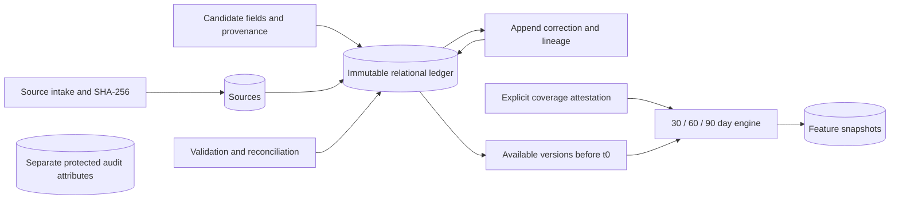

# Architecture

## Second-pass backend extension

The existing deterministic contracts, persistence implementation, reconciliation rules and feature engine are unchanged. The new application layer calls them; routes contain no duplicated financial arithmetic. `config.py` gained only new environment fields and validation for explicitly configured artifacts/demo authorization.

Current flow: unstructured evidence → candidate extraction → validation/reconciliation/human review → canonical event ledger → deterministic features → scoped risk → separate holdout calibration → project score and explanation → offline fairness/policy metadata → immutable assessment snapshot. Raw OCR/model candidates never enter a model feature vector. No generative LLM performs numerical calculations or lending decisions.

New modules:

| Module | Responsibility |
|---|---|
| extraction/sms.py | Exact invented provider templates, original spans, unsupported review |
| extraction/bio.py, local_models.py, training.py | BIO contracts/constrained decoding, local DeBERTa loading, explicit train/evaluation scaffold |
| extraction/documents.py | Raster legibility/orientation/deskew/resize/contrast, coordinate transforms, local TrOCR/LayoutLMv3 candidate adapters |
| datasets.py | Dataset identities, explicit local adapters, research outcome/censoring and point-in-time matrix contracts |
| risk/models.py | Scoped regularized logistic baseline, LightGBM primary, XGBoost challenger, JSON/native persistence |
| calibration/core.py | Disjoint holdout sigmoid/isotonic fitting, metrics/reliability data, pure project display mapping |
| explainability/core.py | Raw-margin TreeSHAP/additivity and evidence-controlled reason catalog |
| fairness/metrics.py | Offline explicit-group counts/rates/Wilson intervals and ThresholdOptimizer research wrapper |
| assessment.py | Evidence/scope-gated assessment values and complete immutable metadata |
| application.py | Intake/review/assessment services; separate insert-only backend journal |
| api/app.py | Versioned FastAPI transport, safe errors and demo token roles |

`BackendBase` has separate metadata from the seven existing core tables. Its `backend_records` table journals jobs, candidate-acceptance audits, evaluation runs and full assessment snapshots. Full snapshots embed their feature snapshot and model/calibration/explanation/policy lineage. Previous full snapshots never update. Application/API corrections automatically append an unscored NEEDS_REVIEW snapshot, linked to the latest prior assessment when present. Fresh coverage is explicitly unknown; earlier scores/coverage are not carried forward. The foundation's assessment skeleton remains valid and unmodified.

Source bytes are stored privately under UUID object names; source metadata/API responses contain no storage path. Source/candidate/event/job inserts commit together; filesystem objects are removed after database failure. Filesystem plus database is not a distributed atomic store and crash recovery/retention remain operational work. Candidate originals survive human acceptance; immutable candidate-review audits accompany new canonical events. Event corrections still use the original Store.correct transaction.

The original Store.correct atomically persists the event version/correction audit. The application then appends its fresh review assessment in a separate journal transaction. Process/storage failure between those commits needs explicit snapshot recovery; no cross-store atomicity or worker retry is claimed. Direct low-level Store.correct remains ledger-only; API/application workflow must use ApplicationService.review. Assessment history is discoverable at GET /api/v1/applicants/{applicant_id}/assessments.

Intake is synchronous. Job GET retrieves the persisted terminal/review/blocker outcome; no background worker, retries or queue system is claimed. Document processing is raster-only; PDF rasterization is not implemented. Local TrOCR recognition returns line candidates. Optional layout extraction uses explicitly coarse line boxes; it does not invent word-level coordinates. Both require review and normalization before canonical acceptance.

API docs `/api/docs`, schema `/api/openapi.json`, project `/docs`. All routes call ApplicationService/core services. Demo tokens map to viewer/reviewer/admin; role headers are not trusted. Reviewer/admin protect corrections, candidate acceptance, assessment creation and fairness group reports. There is no production identity system, tenant/applicant authorization, rate limit, encryption or deployment guarantee. Default tokenless access is viewer on a localhost research server.

Default model state is UNTRAINED/unconfigured and never predicts. Risk artifacts retain their dataset identity, target, feature definitions, training IDs and validation scope. Calibration preserves distinct sample identities and model UUID/version; evaluator rejects overlap with training/calibration. Private feature selection is explicit and protected columns are excluded. Public models cannot score borrower assessments; synthetic outputs are ILLUSTRATIVE; READY means a complete research computation with a declared real-linked artifact, not validated underwriting.

TreeSHAP uses a declared background and raw binary margin/log-odds target, checked against native model output. Calibrated probability and project score are different nonlinear targets, so those contributions are not relabeled as calibrated-score explanations. Fairness metrics are aggregate offline evaluations; protected membership is never inferred or mixed into applicant baseline features. Group results use a separate restricted API capability.

Local model training/loading is optional and never downloads checkpoints/datasets. Actual real-model experiments remain blocked by artifacts/annotations. Environment and package evidence is recorded in dependency-compatibility.md and dependency-compatibility.json; only Python 3.14.8 is exercised.

## Preserved first-pass architecture

The existing directory skeleton was empty. This document and AGENTS.md define the initial architecture. No downstream architecture is inferred from empty package names.

Modules:

| Module | Responsibility |
|---|---|
| config.py | Central environment and safe demo/model flags |
| schemas/contracts.py | Pydantic v2 canonical/candidate/provenance/review/coverage contracts |
| events/intake.py | UUID intake, hash, metadata and allowlisted structured logging |
| validation/rules.py | Candidate review, canonical validation, scoped deduplication/link reconciliation and balance equation |
| storage.py | SQLAlchemy relational envelopes, transactions, correction lineage/history |
| fixtures.py | Stable synthetic IDs, dates, sources, candidates and scenarios |
| features/engine.py | As-of selection, coverage, descriptive features and deterministic snapshot IDs |

SQLAlchemy tables: sources, candidate_extractions, canonical_events, event_corrections, feature_snapshots, assessments, protected_audit_attributes. Indexed applicant/source keys and correction lineage are relational; payloads are validated JSON text. Money is stored as decimal strings to avoid SQLite float coercion. This is an intentional v1 envelope design; analytics SQL should not assume each financial field is a relational column. Foreign keys and unique predecessor constraints prevent orphan sources and branched corrections. SQLite foreign keys are enabled. Database parameters are hidden in SQLAlchemy exceptions; SQL echo is disabled.

Repository methods insert only. Correction and correction-audit records commit atomically. Source identity/hash/locations cannot be corrected in place; incorrect provenance requires new intake. Candidates remain separate. Database administrators can still alter rows: this is not a tamper-proof ledger or authenticated audit service. Pydantic freezing prevents attribute reassignment; nested dictionaries are not deeply immutable in memory. Persisted copies preserve the original JSON.

Feature selection requires event_time, ingestion_time and created_at strictly before t0. Latest available versions supersede earlier versions; corrections after t0 cannot change historical snapshots. Reconciliation sees prior available events outside the feature window to resolve links; cash totals include only events in [t0-window,t0). Coverage itself must be available before t0. Snapshot IDs are UUID5 hashes of deterministic output, not authenticity attestations.

UTC is the canonical timeline and observation-day basis. Non-midnight scoring produces partial endpoints; v1 cannot certify full coverage for that window and will conservatively null complete-history ratios. Baseline feature APIs accept events and coverage only; they cannot consume protected audit attributes.

Local default is SQLite. `postgresql://...` normalizes to `postgresql+psycopg://...`; install `.[postgres]` for its driver. PostgreSQL DDL compilation is tested; live PostgreSQL, concurrency under load, migrations, encryption, authorization and operational deployment are not verified. `create_all` initializes new databases; do not use it as a production migration system.

## Local product surfaces

Streamlit ui/app.py uses one APIClient in ui/api_client.py, with no financial arithmetic. Candidate GET is reviewer-only, document intake preserves explicit synthetic scope, and unknown values are rendered unavailable. Ten pages expose intake/review/ledger/features/assessments/explanations/evaluation/history/docs. API routes still call application/domain services. GET /ready checks database connectivity and reports optional artifact presence, not inferred model accuracy.

api/project_docs.py renders allowlisted repository documentation at /docs; query parameters cannot select files. Swagger/OpenAPI remain /api/docs and /api/openapi.json. Docs include local-demo.md and mcp.md alongside canonical contracts.

Prism is a separate official FastMCP Streamable HTTP server, sharing the configured database. Four read-only tools use Gateway/ApplicationService/Store for accepted ledger and stored snapshots/explanations/aggregate fairness. Bearer credentials are checked before parsing; existing demo roles restrict fairness. Local host/DNS-rebinding protection is explicit, including container binding. No raw source bytes, account IDs/counterparties or training sample IDs are included in Prism payloads. No write tools or model computations are registered.

Docker artifacts publish local ports only and use nonroot Python 3.14 containers with a shared private SQLite volume. Docker build/run is unverified on this host. Separate service correction/journal transactions, production auth/isolation/migrations/retention and real-data/model blockers remain unchanged.
