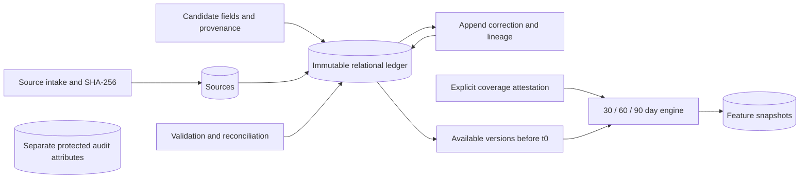

# Architecture

The existing directory skeleton was empty. This document and AGENTS.md define the initial architecture. No downstream architecture is inferred from empty package names.

Modules:

| Module | Responsibility |
|---|---|
| config.py | Central environment and safe demo/model flags |
| schemas/contracts.py | Pydantic v2 canonical/candidate/provenance/review/coverage contracts |
| events/intake.py | UUID intake, hash, metadata and allowlisted structured logging |
| validation/rules.py | Candidate review, canonical validation, scoped deduplication/link reconciliation and balance equation |
| storage.py | SQLAlchemy relational envelopes, transactions, correction lineage/history |
| fixtures.py | Stable synthetic IDs, dates, sources, candidates and scenarios |
| features/engine.py | As-of selection, coverage, descriptive features and deterministic snapshot IDs |

SQLAlchemy tables: sources, candidate_extractions, canonical_events, event_corrections, feature_snapshots, assessments, protected_audit_attributes. Indexed applicant/source keys and correction lineage are relational; payloads are validated JSON text. Money is stored as decimal strings to avoid SQLite float coercion. This is an intentional v1 envelope design; analytics SQL should not assume each financial field is a relational column. Foreign keys and unique predecessor constraints prevent orphan sources and branched corrections. SQLite foreign keys are enabled. Database parameters are hidden in SQLAlchemy exceptions; SQL echo is disabled.

Repository methods insert only. Correction and correction-audit records commit atomically. Source identity/hash/locations cannot be corrected in place; incorrect provenance requires new intake. Candidates remain separate. Database administrators can still alter rows: this is not a tamper-proof ledger or authenticated audit service. Pydantic freezing prevents attribute reassignment; nested dictionaries are not deeply immutable in memory. Persisted copies preserve the original JSON.

Feature selection requires event_time, ingestion_time and created_at strictly before t0. Latest available versions supersede earlier versions; corrections after t0 cannot change historical snapshots. Reconciliation sees prior available events outside the feature window to resolve links; cash totals include only events in [t0-window,t0). Coverage itself must be available before t0. Snapshot IDs are UUID5 hashes of deterministic output, not authenticity attestations.

UTC is the canonical timeline and observation-day basis. Non-midnight scoring produces partial endpoints; v1 cannot certify full coverage for that window and will conservatively null complete-history ratios. Baseline feature APIs accept events and coverage only; they cannot consume protected audit attributes.

Local default is SQLite. `postgresql://...` normalizes to `postgresql+psycopg://...`; install `.[postgres]` for its driver. PostgreSQL DDL compilation is tested; live PostgreSQL, concurrency under load, migrations, encryption, authorization and operational deployment are not verified. `create_all` initializes new databases; do not use it as a production migration system.
